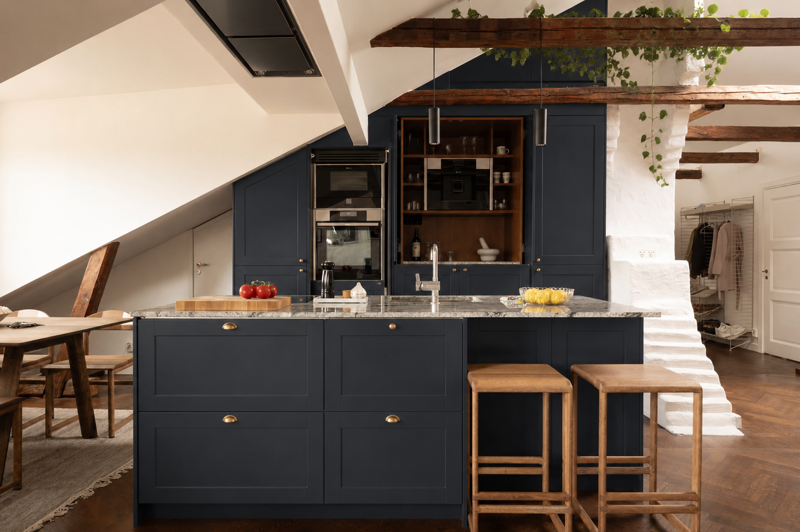

# Koksrenovering

Status: Utforskas
Prioritet: Hog
Idealisk beslutsperiod: september-oktober 2026
Huvudfraga: ska vi renovera fore inflytt, efter inflytt eller i etapper?

## Vision

Den ledande iden just nu ar ett morkblatt kok med varmt tra, massingsdetaljer och stenbankskiva. AI-inspirationen ar sparad har:

## Nuvarande Fakta

- Oppet kok och vardagsrum.
- Nuvarande kok har stor ko, slata luckor, generosa arbetsytor och integrerade vitvaror.
- Vitvaror enligt annons: Siemens kyl/frys; Neff induktionshall, flakt, ugn, mikro, diskmaskin och integrerad espressomaskin.
- Det finns matplats i narheten och forvaring/vinkyl bakom matplatsen.

## Mojliga Omfattningar

| Omfattning | Vad Det Innebar | Plus | Att Se Upp Med |
| --- | --- | --- | --- |
| Kosmetisk uppdatering | Mala eller byta fronter, nya handtag, mindre belysning | Snabbare, mindre stok | Befintlig planlosning styr fortfarande |
| Mellanrenovering | Fronter, bankskiva, diskho/blandare, belysning, vissa vitvaror | Stor visuell effekt | Behover matt och leveranstider |
| Full renovering | Planlosning, stommar, installationer, vitvaror, ytskikt | Mest kontroll | Kostnad, BRF-regler och byggtid |

## Fragor

- Vad gillar vi inte med nuvarande kok?
- Vad maste bli battre: uttryck, forvaring, matlagningsflode, belysning, sittplatser, vitvaror?
- Ar det bla konceptet en seriös riktning eller mest moodboard?
- Vilka delar ar varda att bevara?
- Paverkar nagot arbete VVS, ventilation, el eller barande konstruktion?
- Vilka godkannanden eller anmalningar kraver BRF?

## Matt Som Behovs Pa Tilltradesdagen

- Kons langd, bredd, hojd och overhang.
- Skaplinjer och snedtaksmatt.
- Vitvarumatt och modellnummer.
- Placering av diskho, VVS och el.
- Ventilationsvag och typ av flakt.
- Bankskivans tjocklek och material.
- Avstand mellan ko, skap, matplats och eldstad.

## Startuppgifter

| Uppgift | Agare | Timing | Status | Anteckningar |
| --- | --- | --- | --- | --- |
| Bestam onskad omfattning | Bada | September 2026 | Nasta | Kosmetisk, mellan eller full. |
| Samla 10 referenskok | Bada | September 2026 | Backlog | Skriv varfor varje bild funkar eller inte. |
| Fraga BRF om krav for koksrenovering | Du | Oktober 2026 | Backlog | VVS, ventilation, ljud och hantverksregler. |
| Skapa kortlista pa leverantorer | Du | Oktober 2026 | Backlog | Koksfronter, bankskiva och hantverkare. |
| Mata koket pa tilltradesdagen | Du | 2026-12-21 | Schemalagd | Anvand mattlistan ovan. |

## Beslut Att Ta

- Farg riktning.
- Behalla eller byta bankskiva.
- Behalla eller byta vitvaror.
- Handtagsstil och metallfinish.
- Belysning ovanfor ko och arbetsytor.
- Budgettak.
- Byggtider.

## Lankar Och Referenser

- [Bla Koksinspiration](../03_References/Kitchen_Blue_Inspiration.md)
- [Budget](../00_Home/Budget_Tracker.md)
- [Beslutslogg](../00_Home/Decision_Log.md)
