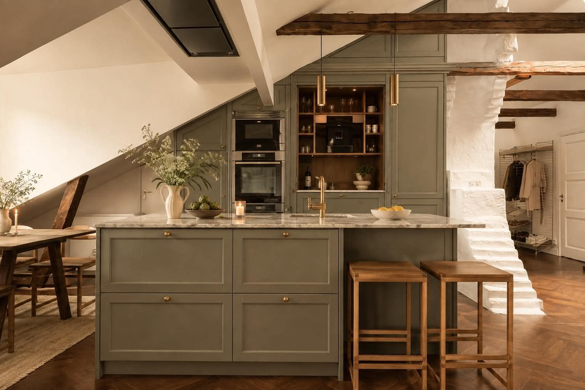
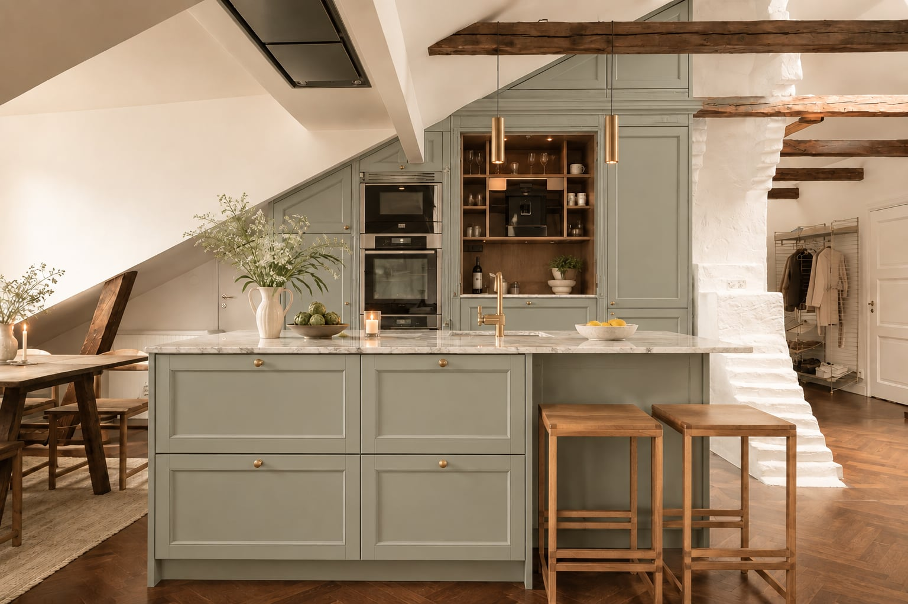

# Bla Koksinspiration

Sparad inspirationsbild:

Nyare inspirationsbild:

Ljusare grön inspirationsbild:

## Vad Som Fungerar I Den Har Riktningen

- Morkbla skap kanns lugna men anda tydliga.
- Varma trabjalkar och pallar gor att koket inte kanns kallt.
- Massingsknoppar ger varme utan att ta over.
- Stenbankskiva ger kontrast och passar lagenhetens karaktar.
- Kokson fortsatter vara den sociala mittpunkten.

## Saker Att Validera

- Exakt bla nyans i dagsljus och kvallsljus.
- Om befintliga fronter kan malas eller bor bytas.
- Om stenbankskivan ska vara kvar, bytas eller plockas upp pa annat satt.
- Hur det bla fungerar med eldstad, bjalkar, golv och matplats.
- Om svarta vitvaror och morka skap gor bakvaggen for tung.

## Sokord For Fler Referenser

- dark blue shaker kitchen
- navy kitchen brass hardware
- attic apartment kitchen beams
- blue kitchen marble countertop
- Scandinavian dark blue kitchen wood
